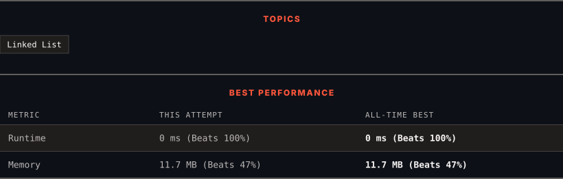

<div align="center">

# 83. Remove Duplicates from Sorted List

      

[](https://leetcode.com/problems/remove-duplicates-from-sorted-list/)

</div>

---

<div align="center">

<picture>
  <source media="(prefers-color-scheme: dark)" srcset="panel-dark.svg">
  <source media="(prefers-color-scheme: light)" srcset="panel-light.svg">
  
</picture>

</div>

> **New personal best** — Runtime improved on this submission.

### HOW IT WENT

| | |
|:--|:--|
| **Attempts** | first try |
| **Time to solve** | 1 h 1 min |
| **Verdicts** | ✅ Accepted |

---

### NOTES

_No notes yet._

---

### SOLUTIONS (1)

| # | File | Language | Date |
|:-:|------|:--------:|:----:|
| 1 | [sol1.c](./sol1.c) | `C` | 2026-09-16 ← **latest** |

---

### PROBLEM DESCRIPTION

Given the `head` of a sorted linked list, *delete all duplicates such that each element appears only once*. Return *the linked list **sorted** as well*.

 

**Example 1:**


```

**Input:** head = [1,1,2]
**Output:** [1,2]

```

**Example 2:**


```

**Input:** head = [1,1,2,3,3]
**Output:** [1,2,3]

```

 

**Constraints:**

	- The number of nodes in the list is in the range `[0, 300]`.

	- `-100 <= Node.val <= 100`

	- The list is guaranteed to be **sorted** in ascending order.

---

<div align="center">

<sub>Auto-synced by <strong>LeetSync</strong> · Built by <a href="https://deveshsamant.in/">Devesh Samant</a></sub>

</div>
