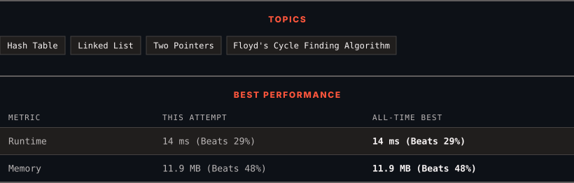

<div align="center">

# 141. Linked List Cycle

      

[](https://leetcode.com/problems/linked-list-cycle/)

</div>

---

<div align="center">

<picture>
  <source media="(prefers-color-scheme: dark)" srcset="panel-dark.svg">
  <source media="(prefers-color-scheme: light)" srcset="panel-light.svg">
  
</picture>

</div>

> **New personal best** — Runtime improved on this submission.

### HOW IT WENT

| | |
|:--|:--|
| **Attempts** | 2 before accepted |
| **Time to solve** | 23 h 50 min |
| **Verdicts** | ❌ Wrong Answer → ✅ Accepted |

---

### NOTES

_No notes yet._

---

### SOLUTIONS (1)

| # | File | Language | Date |
|:-:|------|:--------:|:----:|
| 1 | [sol1.c](./sol1.c) | `C` | 2026-09-17 ← **latest** |

---

### PROBLEM DESCRIPTION

Given `head`, the head of a linked list, determine if the linked list has a cycle in it.

There is a cycle in a linked list if there is some node in the list that can be reached again by continuously following the `next` pointer. Internally, `pos` is used to denote the index of the node that tail's `next` pointer is connected to. **Note that `pos` is not passed as a parameter**.

Return `true`* if there is a cycle in the linked list*. Otherwise, return `false`.

 

**Example 1:**


```

**Input:** head = [3,2,0,-4], pos = 1
**Output:** true
**Explanation:** There is a cycle in the linked list, where the tail connects to the 1st node (0-indexed).

```

**Example 2:**


```

**Input:** head = [1,2], pos = 0
**Output:** true
**Explanation:** There is a cycle in the linked list, where the tail connects to the 0th node.

```

**Example 3:**


```

**Input:** head = [1], pos = -1
**Output:** false
**Explanation:** There is no cycle in the linked list.

```

 

**Constraints:**

	- The number of the nodes in the list is in the range `[0, 10^4]`.

	- `-10^5 <= Node.val <= 10^5`

	- `pos` is `-1` or a **valid index** in the linked-list.

 

**Follow up:** Can you solve it using `O(1)` (i.e. constant) memory?

---

<div align="center">

<sub>Auto-synced by <strong>LeetSync</strong> · Built by <a href="https://deveshsamant.in/">Devesh Samant</a></sub>

</div>
